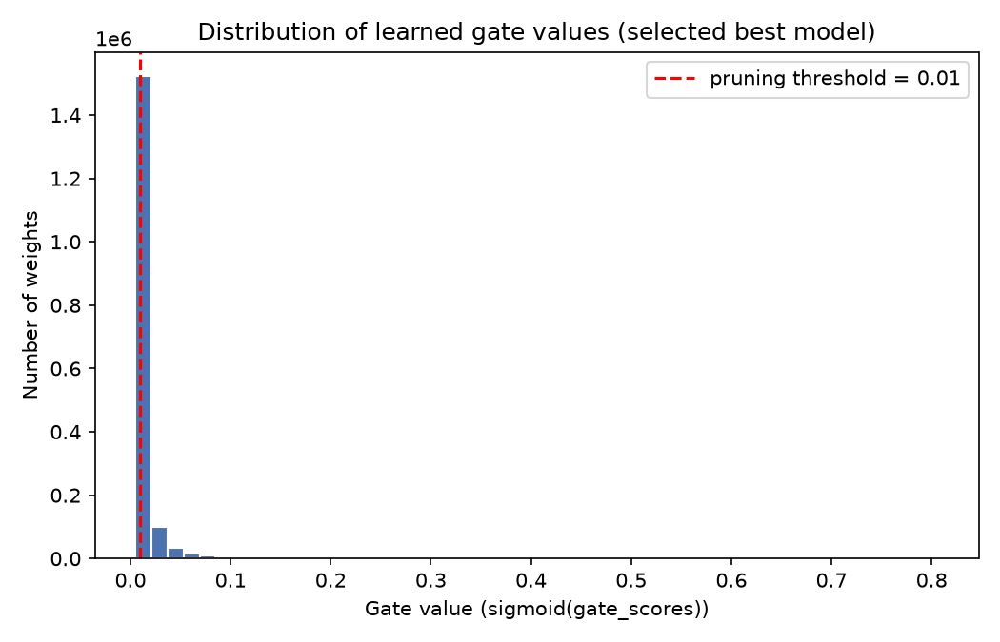

# Self-Pruning Neural Network

## 1. Objective

Build an image classifier for CIFAR-10 in which the network learns, during training, which of its own weights are unnecessary and suppresses them through a learnable gate, rather than pruning being a separate step applied after training finishes, and compare the resulting accuracy/sparsity trade-off across several regularization strengths.

## 2. Approach

Every linear layer in the network is a custom `PrunableLinear` layer that owns three parameters per connection instead of two: `weight`, `bias`, and `gate_scores` (one unconstrained value per weight, same shape as `weight`, registered as `nn.Parameter`). On the forward pass, gate values are computed as `sigmoid(gate_scores)` and multiplied element-wise into `weight` before the linear transform. An L1 penalty on the gate values, scaled by `lambda`, is added to the classification loss so the network is rewarded for closing connections it does not need.

## 3. PrunableLinear Design

```python
gates         = sigmoid(gate_scores)   # strictly in (0, 1)
pruned_weight = weight * gates
output        = pruned_weight @ input + bias
```

- `gate_scores` is registered as `nn.Parameter`, so the optimizer updates it exactly like `weight` and `bias`.
- `gate_scores.shape == weight.shape` — one gate per weight.
- `nn.Linear` is not used internally; `weight`, `bias`, and `gate_scores` are managed directly by the custom layer.
- Because the computation is built entirely from standard differentiable operations, gradients reach `weight`, `gate_scores`, and `bias` in a single backward pass.
- **Sigmoid never outputs an exact zero for finite input.** A gate near 0 makes a connection's contribution negligible, which is functionally equivalent to removing it, but it is not mathematically exact.
- This report defines "pruned" strictly as a gate value below the threshold `1e-2`.

## 4. Model Architecture

```text
CIFAR-10 image (3x32x32) -> Flatten (3072)
  -> PrunableLinear(3072, 512) -> ReLU
  -> PrunableLinear(512, 256)  -> ReLU
  -> PrunableLinear(256, 10)   -> logits (CrossEntropyLoss applies softmax internally)
```

A plain feed-forward MLP was used because the assignment specifies a feed-forward network rather than a CNN. Two hidden layers provide enough capacity to learn a non-trivial CIFAR-10 mapping while keeping the model practical to train repeatedly for the lambda sweep.

## 5. Loss Function

```text
SparsityLoss = sum(sigmoid(gate_scores))
TotalLoss    = ClassificationLoss + lambda * SparsityLoss
```

`ClassificationLoss` is standard `CrossEntropyLoss`. `SparsityLoss` is the raw L1 sum of gate values across every `PrunableLinear` layer, deliberately not normalized by gate count, as required by the assignment.

The L1 penalty continuously pushes gate values toward zero. The classification objective pushes back on gates that are useful for prediction. `lambda` controls the relative strength of the sparsity pressure.

Because `sigmoid(x) > 0` for every finite `x`, gates do not become mathematically equal to zero during ordinary training. Instead, a gate is counted as pruned when its value is below `1e-2`.

## 6. Training Setup

| Setting | Value |
|---|---|
| Dataset | CIFAR-10 (`torchvision.datasets.CIFAR10`) |
| Model | Feed-forward MLP with custom `PrunableLinear` layers |
| Optimizer | Adam |
| Learning rate | 1e-3 |
| Batch size | 128 |
| Epochs per lambda | 25 |
| Lambda values tested | 1e-5, 1e-4, 1e-3 |
| Sparsity threshold | 1e-2 |
| Accuracy tolerance for best-model selection | 0.02 (2 percentage points) |
| Random seed | 42 |

The final comparison used the same 25-epoch training configuration for all three lambda values so that the results are directly comparable.

## 7. Results

The final 25-epoch experiments produced the following real CIFAR-10 test results:

| Lambda | Test Accuracy | Sparsity Level (%) |
|---:|---:|---:|
| 1e-5 | 56.84% | 16.56% |
| 1e-4 | **57.40%** | **72.53%** |
| 1e-3 | 51.92% | **98.73%** |

Official sparsity is the percentage of learned gate values below `1e-2`.

## 8. Lambda Trade-off Analysis

The results show a clear relationship between the sparsity regularization strength and the learned gate values.

When lambda increased from `1e-5` to `1e-4`, sparsity increased substantially from **16.56% to 72.53%**, while test accuracy also increased slightly from **56.84% to 57.40%**. This shows that increasing the sparsity pressure does not necessarily reduce accuracy immediately; moderate regularization can coexist with, and in this experiment slightly improve, generalization.

Increasing lambda further from `1e-4` to `1e-3` increased sparsity from **72.53% to 98.73%**, but test accuracy fell from **57.40% to 51.92%**. The very high lambda therefore produced extremely aggressive pruning at a measurable accuracy cost.

Overall, the experiments demonstrate the expected accuracy/sparsity trade-off: stronger lambda values generally produce more sparse gates, while sufficiently strong pruning pressure can eventually hurt classification performance. The relationship is not strictly monotonic for accuracy, since the moderate `1e-4` setting achieved the highest test accuracy.

The final experiments were run for 25 epochs. Earlier 10-epoch exploratory runs produced little or no official thresholded sparsity, while extending training allowed the learned gates to cross the `1e-2` threshold. Those exploratory runs were not used in the final comparison because the final three lambda values were evaluated under the same 25-epoch configuration.

## 9. Gate Distribution



The histogram above shows the learned gate values for the selected best model, `lambda = 1e-4`. The red dashed line marks the pruning threshold of `0.01`.

The selected model has **72.53%** of its gates below this threshold. The distribution therefore shows a strong concentration of very small gate values on the left side, together with a smaller set of higher-valued gates that remain active. This visual pattern is consistent with the measured sparsity value.

No gate is expected to sit at exactly zero because the sigmoid function produces values strictly between 0 and 1 for finite gate scores.

## 10. Best Model

The best model is selected using a plain-language rule rather than an arbitrary weighted scoring formula:

1. Identify the highest test accuracy achieved across all lambda runs.
2. Treat any run within the configured accuracy tolerance of that best accuracy as having comparable accuracy.
3. Among the comparable-accuracy runs, select the one with the highest sparsity.
4. Never select a model solely because it is sparse if its accuracy has collapsed.

The highest observed test accuracy is **57.40%** at `lambda = 1e-4`. With a tolerance of 2 percentage points, the `lambda = 1e-5` model at 56.84% is also accuracy-comparable. Between those comparable models, `lambda = 1e-4` has much higher sparsity (**72.53%** versus **16.56%**).

Therefore, the selected best model is:

> **Lambda = 1e-4, Test Accuracy = 57.40%, Sparsity = 72.53%.**

The `lambda = 1e-3` model achieves 98.73% sparsity but its 51.92% accuracy is more than 2 percentage points below the best result, so it is not selected.

## 11. Limitations

- **Feed-forward, not convolutional:** an MLP does not exploit the spatial structure of CIFAR-10, so its absolute accuracy is expected to trail a comparable CNN. The purpose of this experiment is the self-pruning mechanism rather than maximizing CIFAR-10 accuracy.
- **Computational constraints:** the final sweep required three independent training runs of 25 epochs, so the experiment was designed to remain practical on commodity hardware.
- **Soft pruning, not hard pruning:** gates near zero still participate in the forward pass with a small non-zero multiplier. Parameters are not physically removed from memory during training.
- **Thresholded sparsity:** because sigmoid never reaches exactly zero, the reported sparsity is defined operationally as `gate < 1e-2`.
- **Unstructured connection pruning:** the method gates individual weights. A high percentage of small gates does not automatically translate into the same percentage of wall-clock speedup unless the model is subsequently converted to a physically pruned representation.
- **Single architecture and dataset:** the conclusions are specific to this feed-forward MLP on CIFAR-10 and should be revalidated for CNNs, other architectures, or other datasets.
- **CPU training:** the final experiments were run on CPU, which increased training time but does not change the mathematical definition of the pruning mechanism.

## 12. Conclusion

The experiment successfully implemented a self-pruning neural network in which learnable sigmoid gates are trained jointly with the model weights using an L1 sparsity penalty.

Across the final 25-epoch lambda sweep, increasing the sparsity pressure produced substantially more thresholded gates:

- `lambda = 1e-5`: **56.84% accuracy, 16.56% sparsity**
- `lambda = 1e-4`: **57.40% accuracy, 72.53% sparsity**
- `lambda = 1e-3`: **51.92% accuracy, 98.73% sparsity**

The selected model is `lambda = 1e-4`, achieving the highest test accuracy while also pruning **72.53% of the learned gates** under the assignment's `1e-2` threshold. The strongest regularization setting demonstrated that sparsity can be pushed to nearly 99%, but doing so caused a noticeable accuracy reduction.

Overall, the results demonstrate that the network can learn which connections to suppress during training and that lambda provides an effective control over the accuracy/sparsity trade-off.
